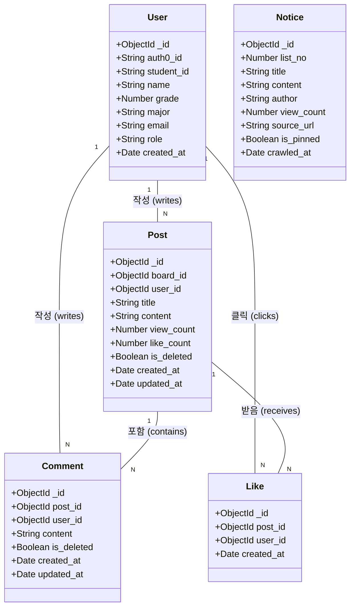
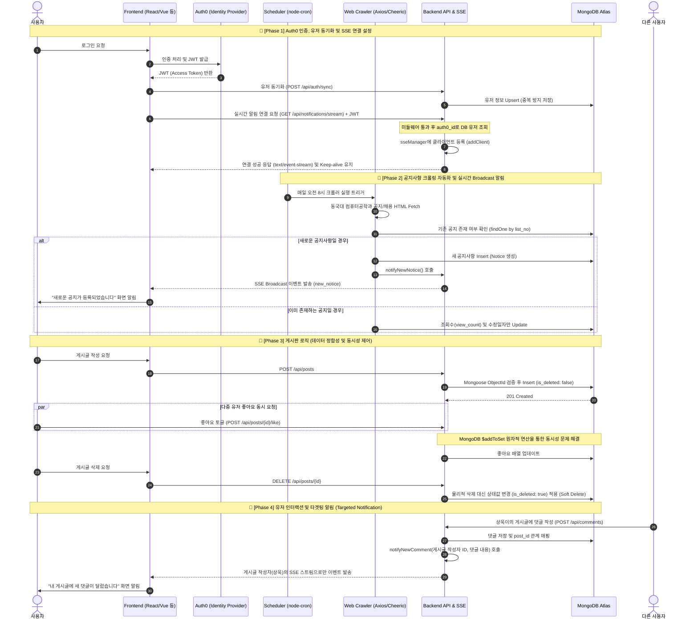

## 3. 설계

### 3.1 데이터베이스 설계 (클래스 다이어그램)

MongoDB를 사용하며 Mongoose ODM으로 스키마를 정의합니다. 컬렉션 간의 연관 관계는 `ObjectId`를 활용한 참조(Reference) 방식으로 설계하였으며, 게시글 및 댓글 컬렉션에는 데이터 복구 가능성을 고려하여 물리적 삭제 대신 Soft Delete 방식을 적용했습니다.


---

### 3.2 백엔드 API 및 인증 아키텍처 설계

Auth0를 활용한 JWT 기반 인증 체계를 구축하고, 커스텀 미들웨어를 통해 API 서버의 보안을 강화했습니다. 

**주요 API 엔드포인트 명세**

| 기능 분류 | 메서드 | 경로 | 인증 | 설명 |
|---|---|---|---|---|
| **유저 연동** | POST | `/api/auth/sync` | 필요 | Auth0 토큰 정보와 클라이언트 데이터를 결합하여 DB에 동기화(Upsert) |
| **게시판 조회** | GET | `/api/posts` | 불필요 | 전체 게시글 목록 조회 (is_deleted: false 필터링 적용) |
| **게시글 작성** | POST | `/api/posts` | 필요 | 신규 글 작성 (ObjectId 규격 강제 변환 검증 포함) |
| **게시글 삭제** | DELETE | `/api/posts/:id` | 필요 | 작성자 권한 검증 후 상태값 변경 (Soft Delete) |
| **좋아요 기능** | POST | `/api/posts/:id/like`| 필요 | 특정 게시글 좋아요 토글 (동시성 제어 적용) |
| **실시간 알림** | GET | `/api/notifications/stream`| 필요 | SSE 방식 단방향 실시간 알림 연결 (새 공지, 댓글 알림) |

---

### 3.3 통합 순서 다이어그램 (Sequence Diagram)

**작성자:** 임상욱 (통합 아키텍처 및 시퀀스 정의)

본 다이어그램은 프로젝트의 전체 라이프사이클을 나타냅니다. 클라이언트의 로그인 및 인증(Auth0)부터 서버의 실시간 알림 연결(SSE), 게시판의 핵심 비즈니스 로직(CRUD 및 동시성 제어), 그리고 백그라운드에서 동작하는 스케줄러 기반의 공지사항 크롤링(웹 스크래핑) 과정까지 모든 시스템의 상호작용을 통합하여 시각화했습니다.


---

### 3.4 핵심 알고리즘 및 비즈니스 로직 처리 흐름

보안 검증, 데이터 정합성 확인, 동시성 제어 등의 백엔드 예외 처리 로직이 포함된 처리 흐름입니다.

**1. 유저 동기화(Sync) 흐름**
```text
함수 handleUserSync(req, res):
  토큰 = req.headers.authorization
  만약 인증실패(토큰, Audience 누락 검증):
    반환 403 Forbidden
  
  // 중복 데이터 방지를 위한 Upsert 전략 적용
  유저정보 = DB.User.findOneAndUpdate(
    { auth0_id: 토큰.sub }, 
    { $set: req.body }, 
    { upsert: true, new: true }
  )
  반환 201 Created
```

**2. 좋아요 처리 (동시성 제어) 흐름**
```text
함수 handleToggleLike(req, res):
  // MongoDB $addToSet을 활용한 원자적 연산 (다중 요청 시 Lock 없이 무결성 보장)
  업데이트결과 = DB.Post.updateOne(
    { _id: 게시글ID },
    { $addToSet: { liked_users: 요청유저ID } }
  )

  만약 업데이트결과.수정됨 == 0:
    // 이미 좋아요를 누른 상태라면 배열에서 제거 ($pull)
    DB.Post.updateOne({ _id: 게시글ID }, { $pull: { liked_users: 요청유저ID } })
  
  반환 200 OK
```

---

## 4. 구현

### 4.1 구현 환경

| 항목 | 내용 |
|------|------|
| 개발 언어 | JavaScript (Node.js 24.11) |
| 프레임워크 | Express.js 4.22 |
| 데이터베이스 | MongoDB Atlas, Mongoose 8.23 |
| 인증 및 보안 | Auth0 (express-oauth2-jwt-bearer) |
| 서버 구조 | REST API 기반 Client-Server 아키텍처 |

### 4.2 핵심 구현 내용

**1. 유저 동기화 (Upsert 적용)**
로그인 시마다 데이터를 새로 생성하지 않고, `upsert: true` 옵션을 사용하여 데이터베이스의 일관성을 유지합니다.
```javascript
router.post('/sync', authMiddleware, async (req, res) => {
  const { student_id, major, name } = req.body;
  const user = await User.findOneAndUpdate(
    { auth0_id: req.user.sub },
    { student_id, major, name },
    { upsert: true, new: true }
  );
  res.status(201).json(user);
});
```

**2. 데이터 영속성을 위한 Soft Delete 적용**
사용자가 게시글을 삭제하더라도 DB에서 완전히 지우지 않고, `is_deleted` 플래그를 `true`로 변경하여 추후 데이터 복구나 관리가 가능하도록 안전망을 구현하였습니다.
```javascript
const post = await Post.findById(req.params.id);
if (post.user_id.toString() !== user._id.toString()) {
  return res.status(403).json({ message: '삭제 권한이 없습니다.' });
}
post.is_deleted = true; // 논리적 삭제
await post.save();
res.status(204).send();
```
}
```
